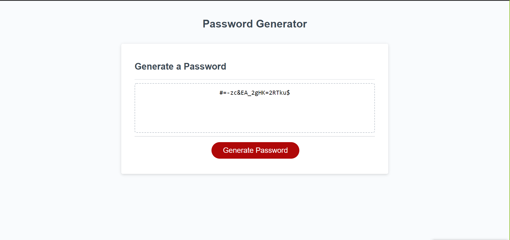
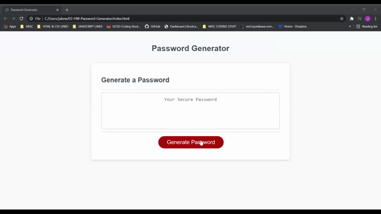

# 03-HW-Password-Generator
## Table of Contents
* [Description](#Description)
* [Technologies](#technologies)
* [Demonstration](#demonstration)
* [Instructions](#instructions)
* [Acknowledgements](#acknowledgements)
* [Questions](#questions)
## Description 
This a password generator application built using javascript. The user selects certain input choices to create a random password. 

## Technologies
* HTML
* CSS
* Javascript
## Demonstration

## Instructions
The user clicks the 'generate password button.' The user selects the numeric length of the desired password. The user decides if the password will contain numbers, lowercase letters, uppercase letters and special characters. Once the user has confirmed all password choices, a randomly generated password is created and placed in the document. 
### About Us
N.A.
## Installation
N.A.
## Team Members
* Jake Williams
## Acknowledgements
* UCSD Coding Bootcamp instructional team and classmates
    * BCS Tutor "Arm" 
## Questions 
If you have any questions, please contact me on:
GitHub at [Jake](https://github.com/jakewill1107)
Email at [Jake](mailto:jbwilliams84@mail.com)